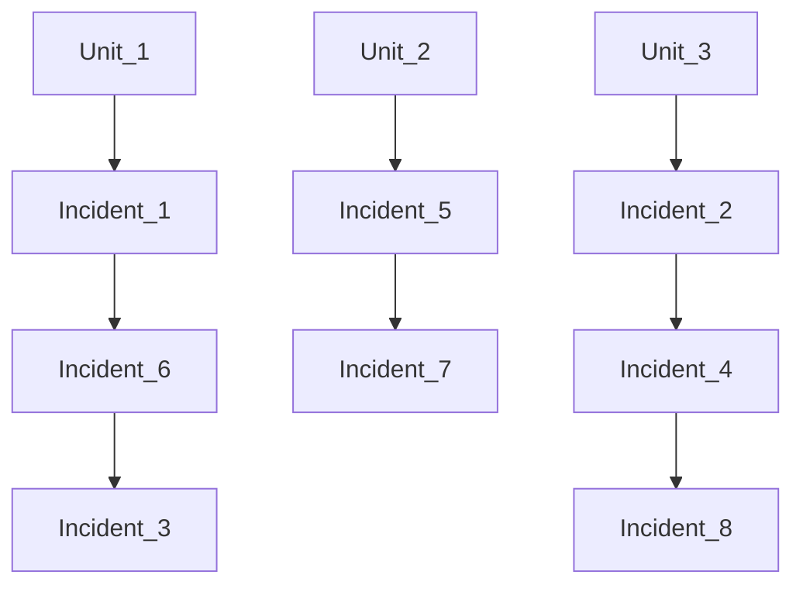

# Post Disaster Management
This project is a post-disaster management system that uses various algorithms to schedule units to handle incidents. The system uses bit representation for units and incidents, and calculates scores based on various factors such as distance, process time, and severity of incidents. The project also uses the MapBox API for visual representation of the scheduling.

## Table of Contents
- [The Paper](#the-paper)
- [The Problem](#the-problem)
- [The Solution and How Does it Work](#the-solution-and-how-does-it-work)
- [Data](#data)
  - [Distance Matrix](#distance-matrix)
  - [Incident Types and Locations](#incident-types-and-locations)
  - [Process Time and Capabilities](#process-time-and-capabilities)
  - [Unit Types](#unit-types)
- [Bit Representation](#bit-representation)
- [MapBox API](#mapbox-api)
- [Using the Program](#using-the-program)
- [Screenshots](#screenshots)
- [License](#license)

## The Paper
You can view my published paper on this subject by clicking [here](https://acikerisim.fsm.edu.tr/xmlui/handle/11352/5158).

## The Problem
This study focuses on the effective allocation and scheduling problems of rescue units in emergency situations where natural disasters occur. In this process, different events, such as fires, collapsed buildings, etc., need to be urgently handled by rescue units. However, in an environment with challenging factors such as limited resources and time pressure, effective assignment and scheduling of rescue units is shaped by search and rescue and scheduling problems.

## The Solution and How Does it Work
Here the Simulated Annealing algorithm is used to find an optimal solution for the scheduling problem. It starts with a random solution and then generates a new solution by making a small change to the current solution. If the new solution is better, it is accepted. If the new solution is worse, it may still be accepted with a certain probability. This allows the algorithm to escape local optima. The probability of accepting worse solutions decreases over time, allowing the algorithm to converge to an optimal solution. But how does one solution generated? The Scheduler class is responsible for generation of solutions (Which stored in Solution class).
<br>
Let's start with what is a solution. Solution is a ArrayList<LinkedList> type of data structure that holds incident-unit pairs. In other word, a unit choosen for each incident until all the incidents are handled. One unit can handle more than one incident. So the incidents stacks on top of each other waiting for a unit to handle them. As a result, a structure like this emerges:



This means the first unit goes to incident_1 and then incident_6 then incident_3 etc. And this whole graph is considered a solution. But how do we decide which unit handles which incident? The `handle()` method on the Scheduler class is responsible for this. Basically the handle method takes the current incident and pairs it with all the available units one by one (Unit-Incident pairs are called Event). These events then stored in an array and a score is calculated for each one of them. This score depends on several things. These are:
 - Handled Severity Point: Shows how many different severities that unit handled.
 - Distance Time: Distance between unit's location and incident's location
 - Process Time: Process time for a Unit to handle an Incident
 - Wait Value: A value that increases each time a unit **not** selected for an Incident. If wait value is too high that means that unit is not selected in a long time and should be on a higher priority.
Based on these variables the score calculated such as:

```java
  this.handledSeverityPoint * Scheduler.SUM_OF_NOT_HANDLED_SEVERITY_COEFFICIENT
+ this.distanceTime * Scheduler.DISTANCE_COEFFICIENT
+ this.processTime * Scheduler.PROCESS_TIME_COEFFICIENT
+ this.waitValue * Scheduler.WAIT_COEFFICIENT;
```

After calculating score for each Event, the Event with the minimum score is chosen. This step is repeated until all incidents are handled. As you notice there are some coefficients we use while we calculating score. These coefficients are used for weighted average. Each of these variables holds different weight for our problem. So how do we decide the value for these coefficients. There are three option:
1. You can use the default values.
2. You can set them yourself.
3. You can use Grid Search algorithm to find the parameters that gives the best solution.

So after all this, how do we decide what is a good solution and what is a bad solution? Remember the graph we saw earlier. Most important part for us that the total time (calculated as total Event time. An event time is processTime + distanceTime.) should be minimized in the mean time solutions with uneven distributions (one unit handles too little incident while the other one handles too much) should be considered as a bad solution. So we use standard deviation as solution score and try to minimize that. At the end of the Simulated Annealing algorithm it finds the solution with the minimum score and that solution is accepted as final solution.  

## Data
The program is accepting 4 different data to work. These are:
 - [Distance Matrix](https://github.com/ISO53/SA-For-Post-Disaster-Management/blob/master/src/main/resources/Distance%20Matrix.json)
 - [Incident Types and Locations](https://github.com/ISO53/SA-For-Post-Disaster-Management/blob/master/src/main/resources/Incident%20Types%20and%20Locations.json)
 - [Process Time and Capabilities](https://github.com/ISO53/SA-For-Post-Disaster-Management/blob/master/src/main/resources/Process%20Time%20and%20Capabilities.json)
 - [Unit Types](https://github.com/ISO53/SA-For-Post-Disaster-Management/blob/master/src/main/resources/Unit%20Types.json)

In order for the algorithm to work correctly, it is vital that these datas is available without any missing/corrupt parts. Let's dive into each of these datas:

### Distance Matrix
Is the most simple data in our problem. The incidents happens at locations. Distance matrix shows the distance between different locations. The length of the distance matrix should be same with the length of the incidents.

### Incident Types and Locations
This file contains incidents in an array. These format of these incidents is like this:
```json
{"status": "111000100", "latitude": 40.985, "longitude": 28.878139}
```
While the status shows the type and status of the incident (as shown in the [bit representation](#bit-representation)) the other two fields shows the location of the incident.

### Process Time and Capabilities
This json file is consists of three parts. The structure is like this:

```json
{
    "incident_names": ["wounded", "fire", "debris"],
    "unit_names": ["ambulance", "fire-dept", "rescue"],
    "process_time_and_capabilities": [
          [10, -1, -1, -1, -1, -1,  -1,  -1,  -1],
          [9 , 15, -1, -1, -1, -1,  -1,  -1,  -1],
          [8 , 13, 20, -1, -1, -1,  -1,  -1,  -1],
          [-1, -1, -1, 15, -1, -1,  -1,  -1,  -1],
          [-1, -1, -1, 13, 30, -1,  -1,  -1,  -1],
          [-1, -1, -1, 10, 20, 45,  -1,  -1,  -1],
          [-1, -1, -1, -1, -1, -1, 150,  -1,  -1],
          [-1, -1, -1, -1, -1, -1, 135, 200,  -1],
          [-1, -1, -1, -1, -1, -1, 120, 180, 240]
      ]
}
```
The first and second fields shows us the names. It is not necessary for the algorithm to work but should be added for visualization. The `process_time_and_capabilities` field shows us two things:
1. Can Unit(n) handle Incident(m)? If not it is represented as -1.
2. If it can handle how long does it take for a Unit(n) to handle Incident(m).
A quick glance to this data and we can see that each unit can only handle it's own type of incidents and the more a unit is capable the less the processing time. 

## Unit Types
This file contains units in a json array. These format of these units is like this:
```json
{"type": "111000000"}
```
Type field shows the type and capability of this unit (as shown in the [bit representation](#bit-representation)).
{"type": "111000000"}

## Bit Representation
Units and incidents are represented as bit strings. For units, a '1' in the bit string represents a capability of the unit, and a '0' represents a lack of capability. For incidents, a '1' in the bit string represents a severity of the incident, and a '0' represents a lack of severity. This allows for efficient comparison of units and incidents. Here's how it looks:

Let us consider the string "101000110" for an incident. This is decoded as:
```
wounded | fire  | debris (shown in Process Time and Capabilities)
1 0 1   | 0 0 0 | 1 1 0  (status for each incident)
light,  |       | light, (shows severity starting from left to right, light to heavy) 
heavy   |       | middle
```
Now let's consider the unit string "110000000". This decoded as:
```
ambulance | fire-dept | rescue (shown in Process Time and Capabilities)
1 1 0     | 0 0 0     | 0 0 0  (type for each unit)
less,     |           |        (shows capabilities starting from left to right,
very      |           |         less-capable to very-capable)
```
Now let's see how this Unit and Incident creates an Event.
```
Incident       -> 101000110
Unit           -> 110000000
After Handling -> 001000110
```
As we can see the unit handled the types of incidents it can handle and capable. The rest stays. The distance and process time calculating and so on...

## MapBox API
The project uses the MapBox API for visual representation of the scheduling. The API requires an access token, which can be obtained from the MapBox website. The access token should be placed in the ACCESS_TOKEN variable in the MapBoxPanel class. The API is free for limited use but requires card information.

## Using the Program
To use the program, you need to load the distance matrix, incidents, process times, and units using the respective buttons in the GUI. Once all data is loaded, you can start the scheduling by clicking the 'START' button. The progress of the scheduling is shown in the progress bar. Once the scheduling is complete, the result is displayed in the bar chart and map visualization tabs.

## Screenshots


## Contributing
   Your contributions are valued! We appreciate your cooperation in making our project better.

## License
   This project is licensed under the [GNU General Public License v3.0](LICENSE). Feel free to modify the content and structure based on your preferences and project specifics.

[](https://github.com/iso53) 
